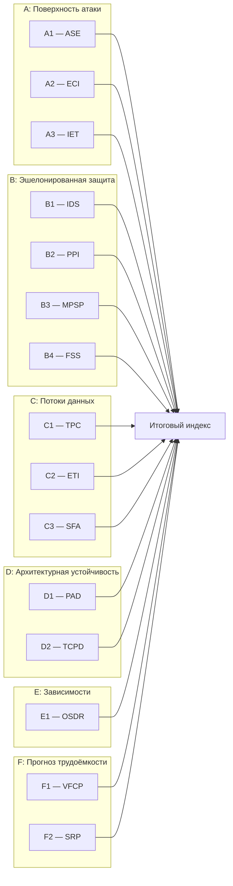
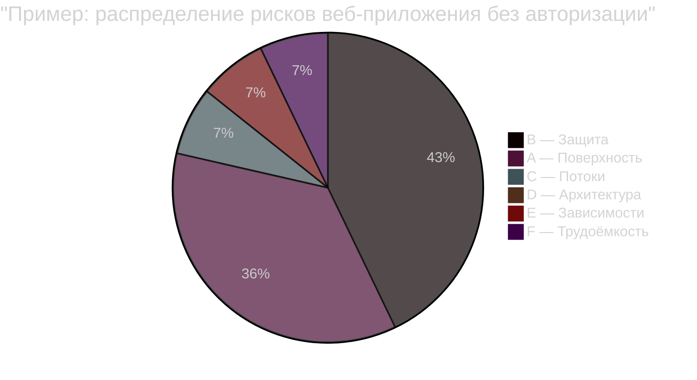
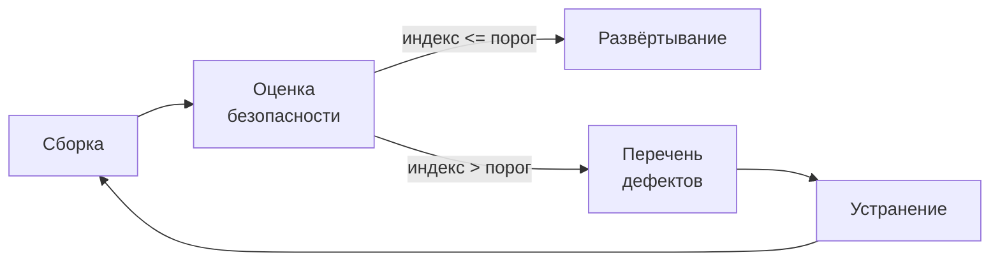

# Метрики архитектурной безопасности кодовой базы

Аналитическая записка: модель оценки, вычисление показателей, агрегация, визуализация и применение в релизном цикле

---

## 1. Постановка задачи

Перед выводом релиза в промышленную эксплуатацию необходимо убедиться, что кодовая база не содержит архитектурных слабостей, способных привести к инцидентам безопасности. Обнаружение таких слабостей после развёртывания приводит к откатам, экстренным исправлениям и повторным циклам согласования, что напрямую увеличивает время вывода релиза.

Существующие средства статического анализа (SAST) и анализа состава зависимостей (SCA) находят конкретные дефекты: инъекции, небезопасную десериализацию, известные уязвимости в библиотеках. Однако они не отвечают на архитектурные вопросы: сколько независимых уровней защиты стоит между внешним запросом и базой данных? одинаково ли защищены разные маршруты к одной и той же операции? насколько сложно будет исправить найденную уязвимость, не сломав смежную функциональность? какова вероятность внести новую проблему при исправлении старой?

Именно эти вопросы определяют, сколько времени уйдёт на доведение релиза до приемлемого уровня безопасности. В настоящей записке предложена модель измерения архитектурной безопасности, состоящая из пятнадцати показателей, сведённых в единый индекс. Модель работает по исходному коду и файлам манифестов сборки, без компиляции и без запуска приложения.

---

## 2. Обзор модели

### 2.1 Структура

Пятнадцать показателей разбиты на шесть групп. Каждая группа отвечает на конкретный вопрос, значимый для принятия решения о готовности релиза. Все показатели приведены к единой шкале от 0 до 1, где 0 означает «проблем не выявлено», 1 — «критический уровень».



### 2.2 Описание групп

Группа A оценивает, что видит атакующий снаружи. Показатель A1 подсчитывает конечные точки, доступные по сети, и их рискованность: отсутствие валидации, отсутствие авторизации, нетипизированные параметры. A2 измеряет сложность кода, обрабатывающего входящие запросы, поскольку сложный метод на «входной двери» с высокой вероятностью содержит ошибку. A3 определяет, насколько код доверяет внешним данным — принимает строго типизированные объекты с ограничениями или пропускает произвольные структуры.

Группа B оценивает глубину обороны — сколько барьеров стоит на пути атакующего. B1 подсчитывает независимые уровни защиты на критических путях от входа до чувствительной операции: аутентификация, авторизация, валидация, санитизация, ограничение частоты, журналирование. B2 измеряет расстояние от открытой точки входа до привилегированных операций. B3 проверяет, одинаково ли защищены разные маршруты к одной операции. B4 анализирует поведение при ошибках: продолжает ли код работу (опасно) или отказывает безопасно.

Группа C оценивает потоки данных: куда утекает информация. C1 считает, через сколько методов проходят данные от внешнего запроса до конечной операции без промежуточной проверки. C2 определяет, попадают ли тексты ошибок и трассировки стека в ответы клиенту. C3 ищет ситуации, когда пароли, токены или ключи оказываются в журналах или ответах сервера.

Группа D оценивает архитектурную устойчивость — готовность к реагированию на инциденты. D1 фиксирует количество языков программирования, поскольку каждая граница между технологиями усложняет единообразное применение политик безопасности. D2 измеряет, на сколько межсервисных вызовов распространяются допущения о безопасности без повторной проверки.

Группа E оценивает надёжность цепочки поставки. E1 классифицирует объявленные зависимости проекта по категориям: базовые библиотеки экосистемы, внутренние модули, сторонние библиотеки, самописная криптография, нестандартные библиотеки безопасности.

Группа F прогнозирует трудоёмкость исправлений. F1 показывает, насколько сложно будет безопасно исправить уязвимость, учитывая связанность кода, его сложность, покрытие тестами и дублирование. F2 показывает вероятность регрессии безопасности — долю конструкций безопасности без тестового покрытия.

### 2.3 Связь с временем вывода релиза

Каждая группа связана с конкретным этапом релизного цикла, на котором обнаружение проблемы приведёт к задержке. Высокие значения групп A и B означают необходимость доработки архитектуры безопасности, что приводит к откату релиза. Проблемы группы C (утечки данных) требуют экстренного исправления и уведомления регулятора. Группа D влияет на время координации между командами при реагировании на инциденты. Группа E определяет, потребуется ли замена или обновление сторонних библиотек. Группа F прогнозирует, сколько итераций «исправление — тестирование — повторная проверка» потребует устранение найденных слабостей.

---

## 3. Вычисление показателей

### 3.1 Исходные данные

Все показатели вычисляются по двум источникам: исходный код и файлы манифестов сборки. Компиляция, среда выполнения и доступ к сети не требуются.

Для показателей групп A, B, C, D и F строится граф вызовов по абстрактному синтаксическому дереву (AST). В графе размечаются три категории узлов: точки входа (методы с сетевыми аннотациями — контроллеры, слушатели очередей), приёмники (операции с базой данных, файловой системой, внешними сервисами) и промежуточные методы. Для каждого метода вычисляется когнитивная сложность, определяются флаги авторизации, валидации, санитизации и тип параметров.

Для показателя E1 парсятся файлы манифестов сборки (pom.xml, build.gradle) без запуска Maven или Gradle.

### 3.2 Сводная таблица показателей

```
Показатель    Название                      Источник           Вес
----------    --------                      --------           ---
A1 (ASE)      Поверхность атаки             Граф + аннотации   0.08
A2 (ECI)      Сложность вблизи входа        Граф + сложность   0.07
A3 (IET)      Входная энтропия              Точки входа        0.07
B1 (IDS)      Глубина эшелонированной защиты Граф (вход→приёмник) 0.10
B2 (PPI)      Близость к привилегиям        Граф (поиск в ширину) 0.10
B3 (MPSP)     Паритет защиты по путям       Обратный граф      0.05
B4 (FSS)      Безопасный отказ              AST (catch-блоки)  0.05
C1 (TPC)      Длина заражённого пути        Граф (вход→приёмник) 0.08
C2 (ETI)      Утечка через ошибки           AST (catch-блоки)  0.06
C3 (SFA)      Утечка секретов               Поиск по паттернам 0.08
D1 (PAD)      Технологические границы       Расширения файлов  0.04
D2 (TCPD)     Цепочка доверия               Граф + авторизация 0.06
E1 (OSDR)     Структура зависимостей        Манифесты сборки   0.06
F1 (VFCP)     Сложность исправления         Граф + тесты       0.05
F2 (SRP)      Регрессия безопасности        AST + тесты        0.05
                                                        Итого: 1.00
```

### 3.3 Нормализация

Часть показателей возвращает значение, уже лежащее в диапазоне [0, 1] (A3, B2, C2, C3, E1, F1, F2). Остальные требуют нормализации. Применяются три стратегии.

Логарифмическая шкала используется для A1 (поверхность атаки): `min(1, log2(1 + ASE) / log2(1 + 1000))`. Логарифм выбран потому, что разница между 10 и 100 точками входа существенна для профиля рисков, тогда как разница между 5000 и 8000 практически его не меняет.

Линейное ограничение с порогом используется для A2, C1, D1 и D2. Значение делится на порог, и результат ограничивается единицей: `min(1, значение / порог)`. Пороги подобраны эмпирически: 30 для сложности вблизи входа (A2), 10 для длины заражённого пути (C1) и цепочки доверия (D2), 4 для технологических границ (D1).

Инверсия применяется для показателей, где исходная семантика обратная (больше = безопаснее): B1, B3, B4. После инверсии (`1 - значение`) все показатели единообразны: 0 = безопасно, 1 = критично.

### 3.4 Агрегация

Итоговый индекс — взвешенное среднее нормализованных значений всех показателей. Веса отражают относительное влияние каждой группы на вероятность инцидента безопасности.

```
Группа                          Суммарный вес   Обоснование
------                          -------------   -----------
B  Эшелонированная защита       0.30            Отсутствие барьеров — сильнейший
                                                предиктор инцидентов
A  Поверхность атаки            0.22            Масштаб и качество входных точек
C  Потоки данных                0.22            Утечка данных — прямой путь к инциденту
D  Архитектурная устойчивость   0.10            Влияет на скорость реагирования
F  Прогноз трудоёмкости         0.10            Определяет стоимость исправлений
E  Внешние зависимости          0.06            Косвенный риск через цепочку поставки
```

Группа B получила наибольший вес (0.30), поскольку отсутствие эшелонированной защиты означает, что компрометация одного уровня немедленно приводит к инциденту. Группы A и C получили равный суммарный вес (по 0.22): широкая поверхность атаки увеличивает количество векторов, а утечки данных — прямое последствие инцидента. Группа E получила наименьший вес (0.06), поскольку риски зависимостей носят косвенный характер и проявляются не при каждом релизе.

Если какой-либо показатель недоступен (например, в проекте нет файлов сборки для E1 или нет Java-исходников для построения графа), он исключается из расчёта, а веса оставшихся показателей пересчитываются пропорционально.

### 3.5 Адресные дефекты

Помимо числовых показателей, при вычислении каждой метрики формируется перечень конкретных дефектов. Дефект — это привязанное к месту в исходном коде (файл, строка, метод) описание проблемы с объяснением опасности и рекомендацией по устранению. Дефекты классифицируются по четырём уровням серьёзности: критический, высокий, средний, низкий.

Такой подход превращает абстрактное «B1 = 0.833» в конкретное «файл OwnerController.java, строка 42: путь от входа до приёмника с 1 из 6 защитных слоёв; добавьте проверку авторизации». Это позволяет команде действовать адресно, не тратя время на интерпретацию агрегированных чисел.

---

## 4. Визуализация

Результаты оценки предполагают три уровня представления, рассчитанных на разных потребителей.

### 4.1 Итоговый индекс

Единственное число от 0 до 1 с цветовой индикацией: зелёный (до 0.15), жёлтый (до 0.30), оранжевый (до 0.50), красный (выше 0.50). Этого достаточно для принятия управленческого решения «допустить / доработать» и для отображения в конвейере сборки.

### 4.2 Радарная диаграмма

Шестиосевая радарная диаграмма, где каждая ось соответствует группе показателей (A, B, C, D, E, F), а значение — среднее нормализованных показателей группы. Чем дальше вершина от центра, тем выше риск в данной области.

Диаграмма решает задачу, которую не решает итоговый индекс: показывает характер рисков. «Вытянутый» в сторону B профиль указывает на проблемы с эшелонированной защитой, в сторону C — на проблемы с потоками данных. Два проекта с одинаковым индексом 0.25 могут иметь принципиально разные профили и, соответственно, требовать разных действий.



### 4.3 Карточки метрик

Для каждого из пятнадцати показателей — карточка с идентификатором, названием, нормализованным значением и цветовой шкалой. Карточки группируются по группам (A, B, C, D, E, F). Это уровень детализации для архитектора или технического руководителя, позволяющий определить, какие именно показатели внутри группы «тянут» значение вверх.

### 4.4 Таблица дефектов

Полный перечень обнаруженных дефектов, отсортированный по серьёзности. Для каждого дефекта: идентификатор метрики, уровень серьёзности, файл и строка, описание, объяснение, рекомендация. Фильтрация по группе метрик и по серьёзности. Это уровень детализации для разработчика, дающий конкретный план действий.

---

## 5. Интерпретация: пороги и действия

### 5.1 Ориентировочные пороги

Пороги определяются организацией и могут различаться для разных категорий проектов. Ниже приведены ориентиры, полученные при апробации модели на двух открытых проектах.

Индекс до 0.15 типичен для хорошо структурированных проектов с настроенной авторизацией и валидацией. Допустим для вывода в промышленную эксплуатацию без дополнительных условий.

Индекс от 0.15 до 0.30 типичен для проектов с отдельными архитектурными слабостями. Рекомендуется разобрать дефекты критической и высокой серьёзности перед выводом в промышленную эксплуатацию.

Индекс выше 0.30 указывает на системные проблемы. Вывод в промышленную эксплуатацию нежелателен без доработки архитектуры безопасности.

Порог может быть дифференцирован: строже для сервисов, обрабатывающих персональные данные или финансовые транзакции, мягче для внутренних утилит и библиотек.

### 5.2 Порядок устранения

При превышении порога команда получает перечень дефектов, определяющий порядок работ. Дефекты критической серьёзности устраняются до вывода в промышленную эксплуатацию. Дефекты высокой серьёзности устраняются или сопровождаются обоснованием принятия риска. Дефекты средней серьёзности планируются к устранению в ближайших итерациях. Дефекты низкой серьёзности остаются на усмотрение команды.

После устранения запускается повторная оценка для подтверждения снижения индекса.

### 5.3 Встраивание в конвейер

Типовой сценарий: на этапе проверки качества в конвейере непрерывной интеграции запускается оценка, результат сравнивается с порогом допуска. При превышении порога конвейер блокирует переход к следующему этапу — развёртыванию, ручному тестированию или публикации артефакта. Перечень дефектов передаётся команде для устранения.



---

## 6. Апробация

Модель проверена на двух открытых Java-проектах, представляющих типичные случаи: веб-приложение с известными архитектурными слабостями и крупная библиотека без собственных сетевых интерфейсов.

### 6.1 Веб-приложение (Spring Petclinic)

Spring Petclinic — веб-приложение Spring Boot из 47 файлов с HTTP-контроллерами, валидацией форм и хранением данных. Авторизация не настроена.

Итоговый индекс: 0.267 (умеренный риск). Профиль рисков сосредоточен в группе B. Модель обнаружила 17 конечных точек, доступных по сети, ни одна из которых не защищена авторизацией. Неаутентифицированный пользователь может напрямую вызывать операции записи и изменения данных (B2 = 1.0, максимум). Из шести возможных уровней защиты реализован один — валидация форм (B1 = 0.833).

При этом код компактен и хорошо структурирован: секреты не утекают (C3 = 0), ошибки не раскрываются клиенту (C2 = 0), сложность исправлений невелика (F1 = 0.078). Основные риски — в отсутствии защитных барьеров, а не в качестве кода.

### 6.2 Библиотека (Langchain4j)

Langchain4j — библиотека для интеграции с языковыми моделями из 2449 файлов на трёх языках (Java, Kotlin, JavaScript). Собственных сетевых интерфейсов нет.

Итоговый индекс: 0.172 (низкий риск). Показатели поверхности атаки, близости к привилегированным операциям и длины путей без проверки обнулились — у библиотеки нет собственных точек входа. Риски проявятся на уровне приложения, которое библиотеку использует.

Структурные показатели обнаружили реальные проблемы: 44% блоков обработки исключений допускают продолжение выполнения вместо безопасного отказа (B4 = 0.443), три языка создают неоднородность (D1 = 0.5), повышенная связанность кода (F1 = 0.289) означает, что исправление уязвимости потребует изменений в нескольких модулях.

### 6.3 Сравнение

```
Показатель                             Langchain4j    Petclinic
----------                             -----------    ---------
A1  Поверхность атаки                  0.000          0.487
A2  Сложность вблизи входа             0.000          0.017
A3  Входная энтропия                   0.000          0.218
B1  Глубина защиты                     1.000          0.833
B2  Близость к привилегиям             0.000          1.000
B3  Паритет защиты путей               0.000          0.000
B4  Безопасный отказ                   0.443          0.000
C1  Длина заражённого пути             0.000          0.100
C2  Утечка через ошибки                0.017          0.000
C3  Утечка секретов                    0.000          0.000
D1  Технологические границы            0.500          0.000
D2  Цепочка доверия                    0.000          0.000
E1  Структура зависимостей             *              *
F1  Сложность исправления              0.289          0.078
F2  Регрессия безопасности             0.076          0.000
-----------------------------------------------------------
ИТОГОВЫЙ ИНДЕКС                        0.172          0.267
```

Итоговый индекс корректно разделил два проекта: веб-приложение без авторизации получило более высокую оценку риска, чем библиотека без сетевого интерфейса. При этом профили рисков принципиально различаются по составу: у веб-приложения преобладают проблемы контроля доступа, у библиотеки — проблемы сопровождаемости и устойчивости к ошибкам. Модель фиксирует не только уровень риска, но и его характер, что позволяет направить усилия на конкретные области.

---

## Приложение А. Алгоритмы вычисления показателей

Для каждого показателя ниже приведены: алгоритм, формула, способ нормализации и вес в итоговом индексе.

### A1. Открытость поверхности атаки (ASE)

Подсчёт входных точек (методы с аннотациями `@RequestMapping`, `@GetMapping`, `@PostMapping`, `@KafkaListener` и аналогичными) с повышающими коэффициентами: нетипизированные параметры (`String`, `Map`, `Object`), отсутствие авторизации (`@PreAuthorize`, `@Secured`), отсутствие валидации. Формула: `ASE = сумма(базовый_вес * повышающие_коэффициенты)` по всем точкам входа. Проекты без сетевых аннотаций (библиотеки) получают ASE = 0.

Нормализация: `min(1, log2(1 + ASE) / log2(1 + 1000))`. Вес: 0.08.

### A2. Индекс взрывной сложности (ECI)

Для каждого метода, достижимого от точки входа по графу вызовов: `ECI = когнитивная_сложность / (расстояние_до_входа + 1)`. Берутся 50 методов с наивысшим ECI. Метод со сложностью 20 на расстоянии 0 от входа (обрабатывает запрос напрямую) получает ECI = 20. Тот же метод на расстоянии 4 получает ECI = 4. Чем ближе сложность к точке входа, тем выше риск.

Нормализация: `min(1, среднее(top-50) / 30)`. Вес: 0.07.

### A3. Входная энтропия (IET)

Для каждого публичного метода, принимающего внешние данные, классифицируется тип параметров. `String`, `Object`, `Map<String,Object>`, `JsonNode` — высокая энтропия (0.8). `byte[]`, `InputStream` — очень высокая (1.0). DTO с `@NotNull`, `@Size`, `@Pattern` — низкая (0.2). `Enum`, `boolean`, ограниченный `int` — минимальная. Наличие валидации в теле метода снижает результирующую энтропию. Итог: взвешенное среднее по точкам входа, вес определяется типом входа (http > mq > job).

Нормализация: не требуется, диапазон [0, 1]. Вес: 0.07.

### B1. Глубина эшелонированной защиты (IDS)

Строится граф вызовов от каждой точки входа до каждого приёмника (БД, файловая система, внешний API, ответ клиенту). На каждом пути классифицируются защитные слои из шести возможных категорий: аутентификация, авторизация, валидация, санитизация, ограничение частоты, аудит-журналирование. `IDS_path = уникальные_категории / 6`. Итоговое значение — минимум по всем критическим путям, поскольку система сильна настолько, насколько силён её слабейший путь.

Нормализация: инверсия `IDS = 1 - IDS_system`. Вес: 0.10.

### B2. Индекс близости к привилегиям (PPI)

Идентификация привилегированных операций (запись и удаление в БД, смена прав, доступ к персональным данным) и публичных точек входа без авторизации. Поиск в ширину по графу вызовов: минимальное количество переходов от публичного входа до привилегированной операции. `PPI = 1 - min(1, ln(расстояние + 1) / ln(11))`. Расстояние 0 (прямой вызов) даёт PPI = 1.0 (максимальный риск), расстояние 10 и более — PPI близко к 0.

Нормализация: не требуется. Вес: 0.10.

### B3. Паритет защиты по путям (MPSP)

Для каждого метода-приёмника через обратный граф вызовов находятся все пути от точек входа. Для каждого пути оценивается набор мер безопасности. `MPSP_operation = min(security) / max(security)` — отношение наименее защищённого пути к наиболее защищённому. Итоговое значение — минимум по всем операциям (самая слабая пара).

Нормализация: инверсия `MPSP = 1 - MPSP_system`. Вес: 0.05.

### B4. Оценка безопасного отказа (FSS)

Классификация всех catch-блоков по поведению после перехвата исключения. Безопасный отказ (fail-closed): повторный выброс исключения, возврат ошибки, отказ в доступе. Небезопасный отказ (fail-open): продолжение выполнения, возврат значения по умолчанию, пустой catch. `FSS = fail_closed / всего`.

Нормализация: инверсия `FSS = 1 - FSS`. Вес: 0.05.

### C1. Сложность пути заражённых данных (TPC)

Статический анализ графа вызовов от точки входа до приёмника. Подсчёт максимального количества последовательных вызовов без валидации или санитизации на любом пути. Длинная цепочка без проверки означает, что заражённые данные проходят глубоко внутрь системы до критической операции.

Нормализация: `min(1, TPC / 10)`. Вес: 0.08.

### C2. Индекс прозрачности ошибок (ETI)

Доля catch-блоков, в которых текст исключения попадает в ответ клиенту. Паттерны утечки: `getMessage()` в HTTP-ответе, `printStackTrace()`, конкатенация имён таблиц или путей в ответе.

Нормализация: не требуется. Вес: 0.06.

### C3. Анализ потоков секретов (SFA)

Идентификация переменных-секретов (`password`, `token`, `secret`, `apiKey`, `creditCard`). Поиск строк, где переменные-секреты совстречаются с паттернами логирования или сериализации. `SFA = строки_с_утечкой / все_строки_с_секретами`.

Нормализация: не требуется. Вес: 0.08.

### D1. Дрейф атак на стыках технологий (PAD)

Подсчёт языков программирования по расширениям файлов: Java, Kotlin, JavaScript, TypeScript, Python, Go, Rust, C#. `PAD = max(0, количество_языков - 1)`. Каждая граница между языками — потенциальная точка потери контекста безопасности, сериализации и конвертации данных.

Нормализация: `min(1, PAD / 4)`. Вес: 0.04.

### D2. Глубина распространения цепочки доверия (TCPD)

Для каждого пути от входной точки с авторизацией до приёмника: сколько промежуточных вызовов после последней проверки авторизации. `TCPD = max(hops_after_last_auth)` по всем путям. В микросервисной архитектуре аутентификация часто проверяется только на входе, а далее сервисы доверяют друг другу; длинная цепочка после последней проверки увеличивает риск.

Нормализация: `min(1, TCPD / 10)`. Вес: 0.06.

### E1. Риск зависимостей (OSDR)

Парсинг файлов манифестов сборки (`pom.xml`, `build.gradle`, `build.gradle.kts`) без запуска Maven или Gradle. Определение groupId проекта из корневого манифеста для выделения внутренних библиотек. Каждая зависимость классифицируется по пяти категориям:

- базовые библиотеки экосистемы (Spring, Jackson, JUnit, Hibernate, SLF4J и аналогичные) — вес 0;
- внутренние библиотеки (тот же groupId) — вес 0;
- самописная криптография — вес 3, поскольку собственная реализация криптографии является одним из наиболее рискованных архитектурных решений;
- сторонние библиотеки безопасности вне базового набора — вес 2;
- прочие зависимости — вес 1.

Формула: `OSDR = min(1.0, (прочие * 1 + самописная_криптография * 3 + сторонняя_безопасность * 2) / 50)`.

Нормализация: не требуется. Вес: 0.06.

### F1. Предиктор сложности исправления (VFCP)

Композитная оценка из пяти нормализованных компонентов: связанность кода (средняя исходящая степень в графе, cap при 20, вес 0.25), когнитивная сложность (средняя по методам, cap при 30, вес 0.25), отсутствие покрытия тестами (доля production-классов, не упомянутых в тестах, вес 0.20), дублирование кода (доля дублированных токенов по хешу нормализованного тела метода, вес 0.15), уровень абстракции (доля неконкретных типов, вес 0.15).

Нормализация: не требуется. Вес: 0.05.

### F2. Вероятность регрессии безопасности (SRP)

Выделение конструкций, связанных с безопасностью (проверки авторизации, валидация, санитизация). Для каждой конструкции проверяется, упоминается ли имя класса-носителя в тестовых файлах. `SRP = непокрытые / всего`. Высокое значение означает, что при исправлении уязвимости можно незаметно нарушить существующую защиту.

Нормализация: не требуется. Вес: 0.05.

---

## Приложение Б. Каталог типов дефектов

Перечень типов дефектов с указанием серьёзности и условий срабатывания. Каждый дефект привязывается к файлу и строке исходного кода, содержит описание проблемы, объяснение опасности и рекомендацию по устранению.

### Группа A (поверхность атаки)

| Показатель | Дефект | Серьёзность | Условие |
|------------|--------|-------------|---------|
| A1 | Конечная точка без аутентификации | высокая | HTTP-метод без `@PreAuthorize` / `@Secured` |
| A1 | Конечная точка без валидации | средняя | Параметры без `@Valid` или явной проверки |
| A2 | Высокая сложность вблизи входа | высокая / средняя | ECI >= 20 (высокая) или >= 10 (средняя) |
| A3 | Высокая энтропия входных данных | высокая / средняя | Энтропия >= 0.9 (высокая) или >= 0.7 (средняя) |

### Группа B (эшелонированная защита)

| Показатель | Дефект | Серьёзность | Условие |
|------------|--------|-------------|---------|
| B1 | Недостаточно защитных слоёв | критическая / высокая | Менее 20% слоёв (критическая) или менее 50% (высокая) |
| B2 | Привилегированная операция близко к входу | критическая / высокая | Расстояние <= 1 (критическая) или <= 3 (высокая) |
| B3 | Несогласованность защиты путей | высокая / средняя | Паритет < 0.3 (высокая) или < 0.5 (средняя) |
| B4 | Пустой catch-блок | критическая | Тело catch-блока пусто |
| B4 | Неоднозначная обработка исключения | средняя | Возврат значения без повторного выброса |

### Группа C (потоки данных)

| Показатель | Дефект | Серьёзность | Условие |
|------------|--------|-------------|---------|
| C1 | Длинный путь без валидации | критическая / высокая / средняя | >= 6 переходов (критическая), >= 4 (высокая), >= 3 (средняя) |
| C2 | Утечка деталей исключения | высокая | `getMessage()`, `printStackTrace()` или `toString()` в ответе |
| C3 | Секрет в журнале или ответе | высокая | Переменная-секрет в контексте логирования или сериализации |

### Группа D (архитектурная устойчивость)

| Показатель | Дефект | Серьёзность | Условие |
|------------|--------|-------------|---------|
| D1 | Технологическая неоднородность | высокая / средняя | >= 4 языков (высокая) или >= 3 (средняя) |
| D2 | Длинная цепочка доверия | высокая / средняя | >= 5 переходов (высокая) или >= 3 (средняя) |

### Группа E (зависимости)

| Показатель | Дефект | Серьёзность | Условие |
|------------|--------|-------------|---------|
| E1 | Самописная криптография | высокая | Зависимость категории «самописная криптография» |
| E1 | Нестандартная библиотека безопасности | средняя | Зависимость категории «сторонняя безопасность» |
| E1 | Избыточное количество сторонних зависимостей | высокая / средняя | Более 40 (высокая) или более 20 (средняя) |

### Группа F (прогноз трудоёмкости)

| Показатель | Дефект | Серьёзность | Условие |
|------------|--------|-------------|---------|
| F1 | Низкое покрытие тестами | средняя | Покрытие менее 30% |
| F1 | Высокое дублирование кода | средняя | Дублирование более 30% |
| F2 | Конструкция безопасности без тестов | средняя | Класс с аннотацией авторизации или валидации не упоминается в тестах |
